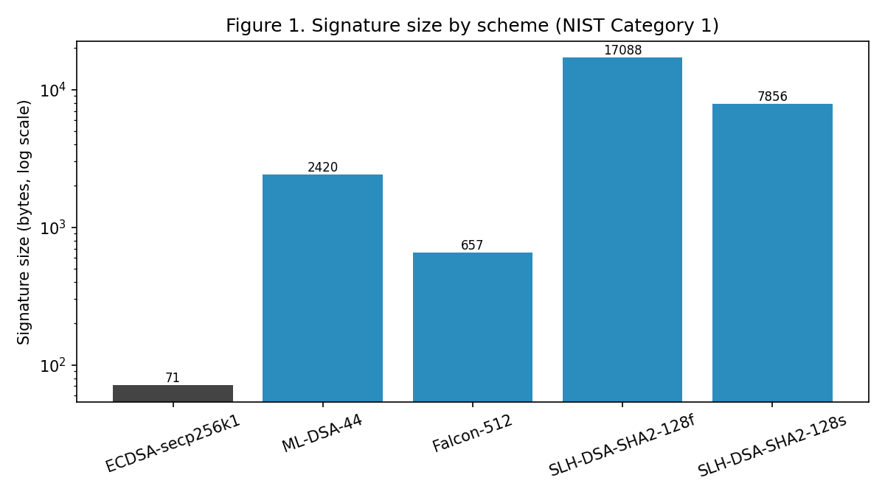
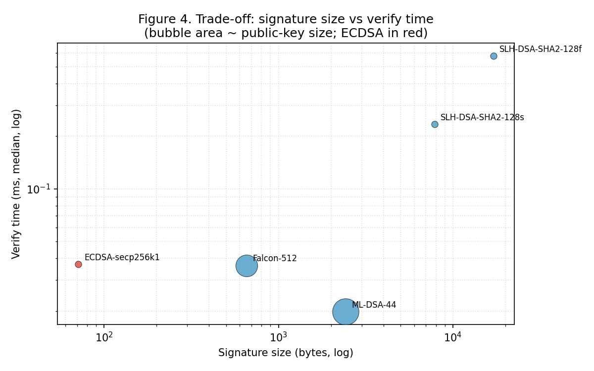
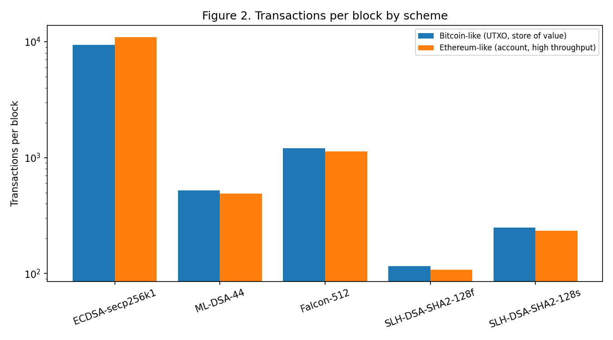
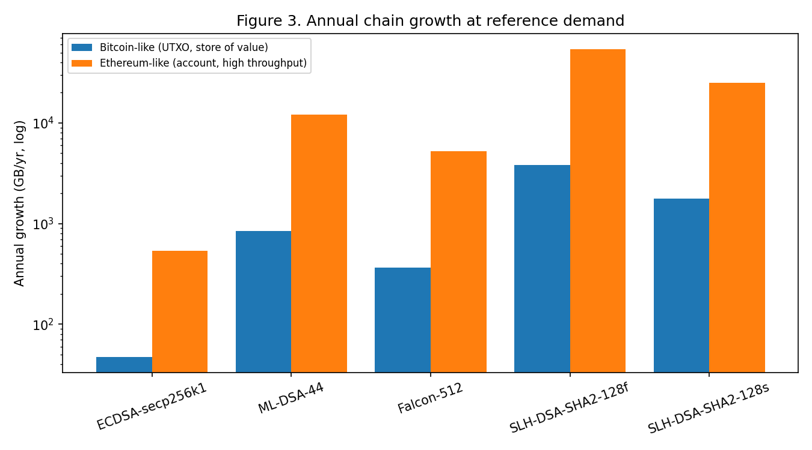
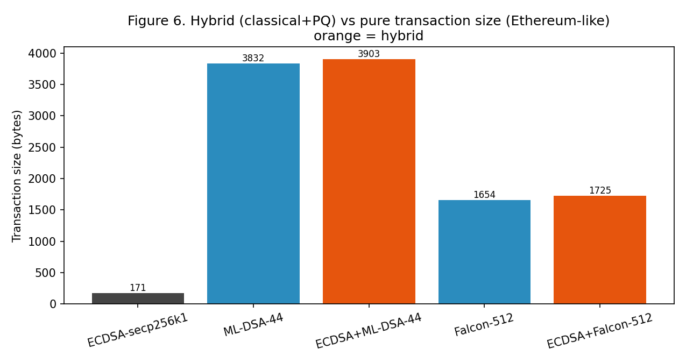
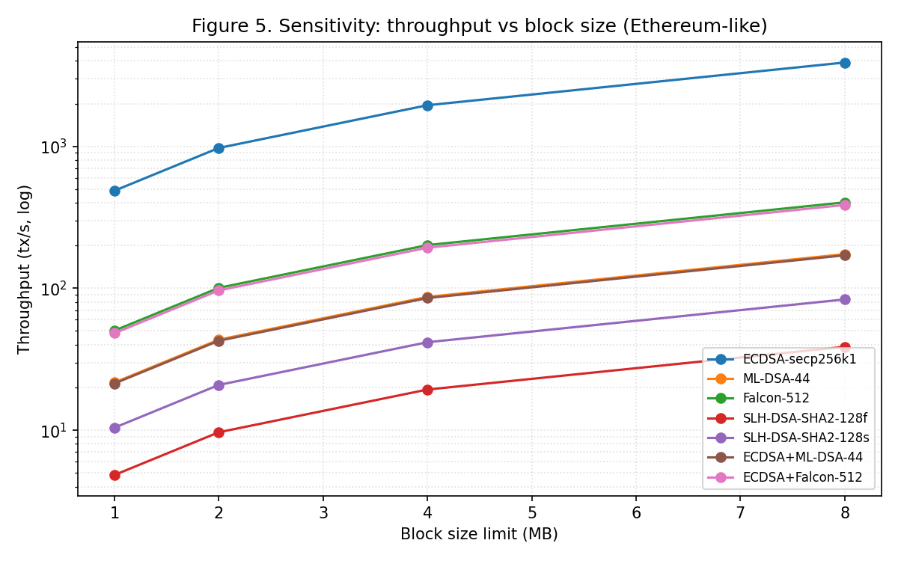

# 1. Introduction

Blockchains derive their security from digital signatures: a transaction is
valid only if it carries a signature that verifies against the spender's public
key. Bitcoin, Ethereum, and essentially every major chain use the Elliptic Curve
Digital Signature Algorithm (ECDSA) over the secp256k1 curve. The hardness
assumption underpinning ECDSA -- the elliptic-curve discrete logarithm problem
-- is broken in polynomial time by Shor's algorithm on a sufficiently large,
fault-tolerant quantum computer. A capable quantum adversary could therefore
forge transactions by recovering private keys from the public keys that
blockchains expose on-chain. Because blockchain history is permanent and public,
this is a "harvest now, break later" exposure: keys revealed today remain
attackable indefinitely.

In August 2024 NIST finalised its first post-quantum signature standards -- FIPS
204 (ML-DSA, formerly CRYSTALS-Dilithium) and FIPS 205 (SLH-DSA, formerly
SPHINCS+) -- with a third, FIPS 206 (FN-DSA, based on Falcon), still in draft.
These schemes resist quantum attack, but their signatures and public keys are
far larger than ECDSA's and their computational profiles differ sharply. For a
blockchain -- where every signature is stored permanently, replicated to every
node, and gossiped across the network -- size is a first-order cost affecting
block capacity, throughput, storage growth, bandwidth, and fees.

While the cryptographic properties of these schemes are well studied, their
*system-level* cost in a blockchain context is under-quantified, and one
structural interaction in particular has been largely overlooked. Our
contributions are:

1. **Quantification of the public-key-recovery penalty in account-based
   blockchains under PQ migration.** ECDSA on an account chain such as Ethereum
   recovers the sender address from the signature (`ecrecover`) and stores no
   public key; no NIST PQ scheme supports recovery, so PQ transactions must
   carry the full public key. We isolate and quantify this asymmetry and show it
   is the dominant reason the migration is costlier on high-throughput chains.
2. **A reproducible four-way primitive benchmark** of ECDSA, ML-DSA-44,
   Falcon-512, and SLH-DSA (128f and 128s) at matched NIST Category 1 security.
3. **A transparent system-level model** propagating measured sizes and times
   into transactions per block, throughput, block verification time, annual
   storage growth, sustained-bandwidth requirement, and storage cost in USD, for
   a Bitcoin-like and an Ethereum-like chain, with a block-size sensitivity
   analysis.
4. **A model of hybrid (classical+PQ) transition signatures**, the realistic
   near-term migration path, showing that dual-signing adds little once a PQ
   scheme is already paid for.

We deliberately do not propose a new cryptographic algorithm; the contribution
is measurement, the public-key-recovery insight, and decision-support analysis.

# 2. Background and Related Work

## 2.1 The quantum threat to blockchain signatures

Shor's algorithm recovers an ECDSA private key from its public key in polynomial
time on a large quantum computer. Blockchains are unusually exposed because
spending typically reveals the public key on-chain, and reused addresses expose
it earlier. The migration question is therefore not *whether* but *to which* PQ
scheme, and *at what system cost*.

## 2.2 The NIST post-quantum signature standards

NIST standardised three signature families with deliberately different
mathematical foundations. ML-DSA (FIPS 204) is a module-lattice scheme with a
balanced profile and is the recommended default. SLH-DSA (FIPS 205) is a
stateless hash-based scheme whose security rests only on its hash function,
making it the most conservative choice at the cost of very large signatures.
Falcon (draft FIPS 206, "FN-DSA") is an NTRU-lattice scheme producing the
smallest PQ signatures, but it relies on floating-point Gaussian sampling that is
difficult to implement in constant time, and it remains a draft standard as of
2026.

## 2.3 Related work and our position

Existing studies fall into two groups. The first benchmarks PQ primitives on
general or constrained platforms (for example ML-KEM/ML-DSA on ARM Cortex-M
microcontrollers), establishing primitive costs but not their blockchain
consequences. The second proposes quantum-safe blockchain architectures or
hybrid transition schemes, typically arguing at the design level without
quantifying the throughput and storage impact of the substitution. Our work
bridges the two and, distinctively, foregrounds the public-key-recovery
asymmetry between ECDSA and PQ schemes and its quantitative effect on
account-model chains, which prior measurement work has not isolated.

# 3. Methodology

## 3.1 Two-layer design

Layer A (measured) benchmarks the cryptographic primitives directly. Layer B
(derived) feeds those measurements into a deterministic model of transaction and
block structure. Separating the layers keeps the empirical core small and
auditable while making the modelling assumptions explicit and replaceable.

## 3.2 Schemes and security level

We compare four schemes at NIST Category 1: ECDSA-secp256k1 (FIPS 186-5),
ML-DSA-44 (FIPS 204), Falcon-512 (draft FIPS 206), and SLH-DSA-SHA2-128f (FIPS
205), with SLH-DSA-SHA2-128s as an optional fifth point. Comparing all three PQ
families against ECDSA maps the entire trade-off space (balanced, compact, and
conservative hash-based) in one harness.

## 3.3 Primitive metrics

For each scheme we report key-generation, signing, and verification time as the
**median and inter-quartile range (IQR)** over up to 1000 iterations after a
discarded warm-up, plus exact public-key and signature sizes. Medians/IQR are
used because timing distributions are right-skewed.

## 3.4 The blockchain model and the recovery asymmetry

We model two chains. The Bitcoin-like chain is a UTXO store-of-value design
(~2 MB effective block, 600 s interval, 80 B header); spending reveals the
spending key, so every scheme -- including ECDSA -- carries the public key
on-chain. The Ethereum-like chain is an account-model design (~1.875 MB
per-block budget, 12 s interval). Crucially, ECDSA on an account chain
*recovers* the sender from the signature (`ecrecover`) and stores no public key,
while PQ schemes have no recovery equivalent and must include the full key. The
model encodes this asymmetry explicitly: ECDSA stores 0 public-key bytes on the
account chain, every PQ scheme stores its full key, and we treat the difference
as the *public-key-recovery penalty*. All constants live in one configuration
file so reviewers can substitute their own.

## 3.5 Derived system metrics

For each (chain, scheme) we derive: transaction size, transactions per block,
throughput (tx/s under the fixed interval), block verification time, annual
on-disk growth at a fixed reference demand, the sustained bandwidth required to
carry that demand, and the resulting annual storage cost. Costs use
representative 2026 cloud object-storage prices (verified): Backblaze B2 at
~$0.06/GB/year (low) and AWS S3 Standard at ~$0.276/GB/year (high). Every PQ
result is also expressed as a ratio to the ECDSA baseline; absolute timings are
machine-dependent, so ratios are the portable findings.

## 3.6 Hybrid transition signatures

Because no operator will switch from ECDSA to a PQ scheme overnight, we model the
realistic transition path: hybrid transactions carrying *both* a classical ECDSA
signature and a post-quantum signature (and, where applicable, the PQ public
key). We model ECDSA+ML-DSA-44 and ECDSA+Falcon-512, with hybrid transaction
size the sum of both signatures plus stored keys, and hybrid verification time
the sum of both verifications.

## 3.7 Sensitivity analysis

To test robustness we sweep the Ethereum-like block-size limit from 1 to 8 MB
and recompute throughput for every scheme, and we note the effect of doubling
demand (which scales storage growth, bandwidth, and cost linearly).

## 3.8 Controls and fairness

All benchmarks ran on a single machine with a pinned software stack; versions
are reported. Warm-up iterations are discarded; each operation is timed in
isolation; the liboqs version is pinned. For pathologically slow operations
(notably SLH-DSA-128s signing) a per-operation wall-clock budget caps the
iteration count and the *actual* number of contributing iterations is recorded.

# 4. Implementation

The primitive layer wraps the Open Quantum Safe `liboqs` C library (pinned to
release 0.15.0) through its Python bindings for the PQ schemes, and the
`coincurve` bindings to libsecp256k1 -- the same library Bitcoin Core uses -- for
ECDSA, behind one uniform interface (`keypair`, `sign`, `verify`, `sizes`). A
test suite asserts, for every scheme, a sign-verify round-trip and rejection
under tampered messages, tampered signatures, and unrelated keys. The blockchain
model, hybrids, cost, and sensitivity sweep are pure deterministic functions over
the measured data and a documented configuration file. The whole pipeline --
tests, benchmarks, model, figures -- reproduces from one command, with a Docker
image pinning the toolchain including the exact liboqs build.

# 5. Results

## 5.1 Primitive benchmarks (Layer A)

Table 1 reports primitive costs at NIST Category 1 (2-core x86_64, Python 3.10,
liboqs 0.15.0; full provenance released).

**Table 1. Primitive microbenchmarks (NIST Category 1).** Median operation time in milliseconds; key/signature sizes in bytes; Sig/E = signature size relative to ECDSA.

| Scheme | Standard | Keygen | Sign | Verify | PK B | Sig B | Sig/E |
|---|---|---:|---:|---:|---:|---:|---:|
| ECDSA-secp256k1 | FIPS 186-5 | 0.039 | 0.065 | 0.034 | 33 | 71 | 1x |
| ML-DSA-44 | FIPS 204 | 0.018 | 0.042 | 0.018 | 1312 | 2420 | 34x |
| Falcon-512 | FIPS 206 (draft) | 5.683 | 0.208 | 0.038 | 897 | 655 | 9x |
| SLH-DSA-SHA2-128f | FIPS 205 | 0.264 | 6.169 | 0.568 | 32 | 17088 | 241x |
| SLH-DSA-SHA2-128s | FIPS 205 | 16.682 | 129.124 | 0.227 | 32 | 7856 | 111x |

Falcon signatures are variable-length; we report a representative ~655 B (the
scheme's signatures span roughly 650-666 B), and quote this single value
consistently. Note that the "Sig/E" column is a *signature-size* ratio (signature
bytes only); the *transaction-size* ratios quoted later (Section 5.3, e.g. 18-22x
for ML-DSA) use a different denominator -- the full transaction (base overhead +
signature + any public key) -- so the two sets of multipliers are not directly
comparable by construction.

Post-quantum is not synonymous with slow: ML-DSA-44 is *faster* than ECDSA on
all three operations. Signature size is the real cost (Figure 1): every PQ
signature dwarfs ECDSA's 71 bytes. Each family has a distinct pathology -- Falcon
has the smallest PQ signature but ~147x ECDSA key generation, SLH-DSA-128s signs
~2000x slower, and SLH-DSA-128f trades that for a 17 KB signature. Figure 4 plots
the trade-off space, with ML-DSA in the favourable low-verify-time/moderate-size
region.

## 5.2 The public-key-recovery penalty

The most consequential result is structural rather than numeric. On the
Bitcoin-like (UTXO) chain, every scheme carries the public key when funds are
spent, so all schemes pay their key size on-chain. On the Ethereum-like
(account) chain, ECDSA does **not**: the sender is recovered from the signature
via `ecrecover`, so an ECDSA transaction stores *zero* public-key bytes (171 B
total in our model). No NIST post-quantum scheme supports this recovery, so every
PQ transaction must carry its full public key -- 1312 B for ML-DSA, 897 B for
Falcon -- on top of the larger signature.

The effect is that the account chain, despite its smaller per-transaction
overhead, suffers a *larger relative* inflation than the UTXO chain. For ML-DSA
the transaction grows 22.4x on the account chain versus 18.0x on the UTXO chain;
the public key alone accounts for roughly a third of the ML-DSA transaction.

This per-transaction figure, however, assumes the public key is carried on every
transaction; Section 5.2.1 shows that an account chain can instead store it once,
which changes the picture and which regime the penalty applies to. The
observation that `ecrecover` has no post-quantum analogue is itself discussed in
the Ethereum account-abstraction and migration community; our contribution is not
that observation but its **quantification** and the analysis of when it bites.

### 5.2.1 Amortizing the public key: store-once

A natural mitigation, and the first objection a reviewer raises, is that an
account-model chain need not carry the public key on every transaction: it can
store the key once at first use and reference it thereafter. We model both
regimes (Table 2a). At **first use** the registering transaction carries the full
key (the figures above); in **steady state** subsequent transactions carry only
the signature.

**Table 2a. First-use vs steady-state account transactions (Ethereum-like).**

| Scheme | Tx first-use (B) | Tx steady-state (B) | Steady xECDSA | Throughput first / steady (tx/s) |
|---|---:|---:|---:|---:|
| ECDSA | 171 | 171 | 1.0x | 913 / 913 |
| ML-DSA-44 | 3832 | 2520 | 14.7x | 41 / 62 |
| Falcon-512 | 1654 | 757 | 4.4x | 94 / 206 |
| SLH-DSA-128f | 17220 | 17188 | 100.5x | 9.0 / 9.1 |
| SLH-DSA-128s | 7988 | 7956 | 46.5x | 19.5 / 19.6 |

Amortisation substantially relaxes the penalty for the lattice schemes -- ML-DSA
falls from 22.4x to 14.7x and Falcon, whose public key was most of its bulk, from
9.7x to 4.4x (its steady-state throughput more than doubles) -- but barely helps
SLH-DSA, whose cost is dominated by its multi-kilobyte signature, not its 32-byte
key. The honest, sharpened statement of the recovery penalty is therefore: **it
is a one-time (first-use) and migration-wave cost, not a perpetual per-transaction
cost, and in steady state the per-transaction penalty is set by signature size.**
The penalty remains acute for workloads dominated by new or single-use accounts
and during the migration wave when every account re-registers a post-quantum key;
it is largely amortised for long-lived, high-activity accounts. This refinement
strengthens rather than removes the result: it identifies exactly where the
post-quantum account-chain cost concentrates.

## 5.3 Blockchain impact (Layer B)

Propagating measured sizes and verify times through the block model yields Table
2 (pure schemes).

**Table 2. Modelled blockchain impact (pure schemes).** Tx B = transaction size (bytes); Tx/blk = transactions per block; tx/s = peak throughput; GB/yr = annual growth; Tx/E = transaction size relative to ECDSA.

| Chain | Scheme | Tx B | Tx/blk | tx/s | GB/yr | Tx/E |
|---|---|---:|---:|---:|---:|---:|
| Bitcoin-like | ECDSA | 214 | 9345 | 15.6 | 47 | 1.0x |
| Bitcoin-like | ML-DSA-44 | 3842 | 520 | 0.87 | 849 | 18.0x |
| Bitcoin-like | Falcon-512 | 1664 | 1201 | 2.00 | 368 | 7.8x |
| Bitcoin-like | SLH-DSA-128f | 17230 | 116 | 0.19 | 3806 | 80.5x |
| Bitcoin-like | SLH-DSA-128s | 7998 | 250 | 0.42 | 1767 | 37.4x |
| Ethereum-like | ECDSA | 171 | 10961 | 913 | 540 | 1.0x |
| Ethereum-like | ML-DSA-44 | 3832 | 489 | 40.8 | 12093 | 22.4x |
| Ethereum-like | Falcon-512 | 1654 | 1133 | 94.4 | 5214 | 9.7x |
| Ethereum-like | SLH-DSA-128f | 17220 | 108 | 9.0 | 54342 | 100.7x |
| Ethereum-like | SLH-DSA-128s | 7988 | 234 | 19.5 | 25208 | 46.7x |

Transactions per block (Figure 2) fall by roughly an order of magnitude for the
lattice schemes and nearly two for SLH-DSA-128f; annual growth (Figure 3) rises
correspondingly.

## 5.4 Hybrid transition signatures

Real migrations run classical and post-quantum signatures side by side for a
transition period. Figure 6 compares hybrid and pure transaction sizes on the
account chain. The key result is that **hybrid is nearly free relative to going
post-quantum at all**: ECDSA+ML-DSA-44 is 3903 B versus 3832 B for pure ML-DSA
(a 1.9% increase), because the 71-byte ECDSA signature is negligible beside the
PQ signature and public key. The same holds for Falcon (1725 B hybrid vs 1654 B
pure). The practical implication is encouraging: operators can retain classical
security guarantees throughout migration at almost no marginal on-chain cost once
they have accepted the post-quantum overhead.

## 5.5 Bandwidth and storage cost

Translating growth into operational terms, the sustained bandwidth required to
carry the reference demand rises from 0.14 Mbps (ECDSA) to 3.1 Mbps (ML-DSA) and
13.8 Mbps (SLH-DSA-128f) on the account chain. At representative 2026 cloud
object-storage prices ($0.06-$0.276/GB/year), annual storage cost for the chain's
growth rises from roughly $32-149 (ECDSA) to $726-3338 (ML-DSA), $313-1441
(Falcon), and $3261-14998 (SLH-DSA-128f). These are first-order, single-replica
figures intended to convey orders of magnitude rather than precise budgets;
real networks replicate across thousands of nodes, multiplying the absolute cost
while preserving the ratios.

## 5.6 Sensitivity to block size

Figure 5 sweeps the Ethereum-like block-size limit from 1 to 8 MB. Throughput
scales nearly linearly with block size for every scheme, and the *ordering* and
*relative gaps* between schemes are preserved across the range -- the lattice
schemes and Falcon track each other, the SLH-DSA variants trail, and ECDSA leads
by roughly an order of magnitude throughout. The post-quantum penalty is thus
structural, not an artefact of a particular block-size choice; enlarging blocks
raises absolute throughput but does not close the relative gap. Doubling demand
scales storage growth, bandwidth, and cost linearly without changing the ranking.

# 6. Discussion

## 6.1 Answering the research questions

On RQ1, the lattice schemes are computationally competitive with -- and ML-DSA
faster than -- ECDSA, while signatures are much larger. On RQ2, the size penalty
dominates, cutting throughput and raising storage growth, bandwidth, and cost by
roughly 8x (Falcon) to 100x (SLH-DSA-128f), with the public-key-recovery penalty
amplifying the effect on account chains. On RQ3, the best observed trade-off in
our model is ML-DSA-44; Falcon is attractive only where on-chain bytes dominate
and its slow, side-channel-sensitive key generation is acceptable; SLH-DSA is a
conservative hash-based hedge that is hard to justify for a high-throughput chain.

Revisiting the hypotheses: H1 (verification stays within a small constant of
ECDSA while signatures inflate 10-100x) is supported, with the nuance that
ML-DSA is faster; H2 (size, not CPU, is the binding constraint) is strongly
supported; H3 (Falcon has the best size profile but practical blockers leave
ML-DSA the safer choice) is supported by the combined size, speed,
standardisation, and implementation-risk picture.

## 6.2 Falcon's implementation and side-channel risks

Falcon's 655-byte signature is the smallest of any scheme here, and an engineer
optimising purely for on-chain bytes will be tempted to choose it. We caution
against doing so without weighing three factors. First, Falcon signing requires
sampling from a discrete Gaussian distribution using floating-point arithmetic;
producing a constant-time implementation is notoriously difficult, and
non-constant-time implementations have been shown to leak key material through
timing and power side channels. Second, Falcon's key generation is slow and
variable (~147x ECDSA in our measurements), which matters for systems that
rotate keys frequently. Third, Falcon (FN-DSA) remains a *draft* standard (FIPS
206) as of 2026, whereas ML-DSA and SLH-DSA are finalised; building consensus-
critical infrastructure on a draft carries standardisation risk. For a
blockchain, where a signing-side side channel could expose validator or user
keys and where implementations must be reproduced across many independent
clients, these risks weigh heavily. ML-DSA's larger signature buys a markedly
simpler, integer-only, finalised implementation -- a trade most chains should
prefer.

## 6.3 Recommendation and its limits

Our measurements support the statement that *ML-DSA-44 provides the best observed
trade-off in our model*. We deliberately frame it this way rather than as an
unconditional drop-in recommendation: our model does not weigh long-term security
margin across families, does not account for signature-aggregation schemes that
could change the size calculus, and does not evaluate implementation quality
beyond the reference library. A chain prioritising the most conservative security
assumptions might still prefer hash-based SLH-DSA; one that solves the size
problem through aggregation might revisit Falcon. The contribution is the
quantified trade-off and the recovery-penalty insight, not a universal verdict.

# 7. Threats to Validity

Construct validity: `liboqs` is a reference/prototyping library, so absolute
timings are not production-representative; we emphasise ratios. The cost and
bandwidth figures are first-order, single-replica, and price-assumption
dependent; they convey magnitude, not budgets. Internal validity: timing noise is
mitigated by warm-up, isolation, many iterations, and median/IQR reporting; the
SLH-DSA-128s medians rest on fewer (time-capped) iterations, with exact counts
recorded -- a full-length re-run is advised for camera-ready numbers. External
validity: results come from one machine; the version-pinned, one-command pipeline
enables reproduction. Model fidelity: the block model is first-order and abstracts
away mempool, networking, and consensus dynamics, and the Ethereum-like byte
budget simplifies gas accounting; these are documented and parameterised. The
sensitivity analysis shows the conclusions are robust to block size, but a full
network-propagation and orphan-rate study is future work. Finally, Falcon's draft
status and constant-time-implementation difficulty are real adoption barriers a
pure performance comparison does not capture.

# 8. Conclusion and Future Work

We measured the cost of making blockchain signatures quantum-resistant and
propagated it to the system level. Compute is not the barrier -- ML-DSA is faster
than ECDSA -- but signature size is, and the often-overlooked public-key-recovery
asymmetry makes the penalty worst on the high-throughput account chains that can
least afford it. Hybrid transition signatures are nearly free once a PQ scheme is
adopted, and the conclusions are robust to block size. ML-DSA-44 offers the best
observed trade-off in our model.

Three directions would extend this work. First, **signature aggregation**
(for example BLS-style or lattice aggregation) could amortise PQ signature size
across many transactions and may reorder the recommendation. Second, a
**network-propagation and consensus analysis** -- block propagation delay, orphan
rate, and bandwidth at realistic node counts -- would deepen the systems
contribution beyond the first-order capacity and bandwidth model here. Third,
**hardware-optimised re-benchmarking** on production implementations, with
full-length iteration counts, would sharpen the absolute numbers. Together these
signal that quantum-safe blockchain migration is a larger systems problem than
primitive benchmarking, and the recovery-penalty result is, we believe, the most
fruitful thread to pull next.

# Data and Code Availability

All source code, configuration, raw result CSVs, environment provenance, and
figure-generation scripts are available in the project repository and archived
with a DOI. The full pipeline reproduces from a single command, and a Docker
image pins the complete toolchain including the exact liboqs build.

# References

1. NIST. *FIPS 204: Module-Lattice-Based Digital Signature Standard (ML-DSA).* 2024. doi:10.6028/NIST.FIPS.204
2. NIST. *FIPS 205: Stateless Hash-Based Digital Signature Standard (SLH-DSA).* 2024. doi:10.6028/NIST.FIPS.205
3. NIST. *FIPS 206 (draft): FN-DSA (Falcon).* 2025.
4. NIST. *FIPS 203: Module-Lattice-Based Key-Encapsulation Mechanism Standard.* 2024. doi:10.6028/NIST.FIPS.203
5. NIST. *FIPS 186-5: Digital Signature Standard (DSS).* 2023. doi:10.6028/NIST.FIPS.186-5
6. P. W. Shor. "Polynomial-Time Algorithms for Prime Factorization and Discrete Logarithms on a Quantum Computer." *SIAM J. Computing* 26(5):1484-1509, 1997.
7. L. Ducas et al. "CRYSTALS-Dilithium: A Lattice-Based Digital Signature Scheme." *IACR TCHES*, 2018.
8. P.-A. Fouque et al. "Falcon: Fast-Fourier Lattice-Based Compact Signatures over NTRU." NIST PQC, 2020.
9. D. J. Bernstein et al. "The SPHINCS+ Signature Framework." *ACM CCS*, 2019.
10. D. Stebila and M. Mosca. "Post-Quantum Key Exchange for the Internet and the Open Quantum Safe Project." *SAC*, 2016.
11. Open Quantum Safe Project. *liboqs* (v0.15.0), 2025. https://github.com/open-quantum-safe/liboqs
12. S. Nakamoto. *Bitcoin: A Peer-to-Peer Electronic Cash System.* 2008.
13. G. Wood. *Ethereum: A Secure Decentralised Generalised Transaction Ledger.* Yellow Paper, 2014.
14. A. J. Menezes, P. C. van Oorschot, S. A. Vanstone. *Handbook of Applied Cryptography.* CRC Press, 1996.
15. D. Johnson, A. Menezes, S. Vanstone. "The Elliptic Curve Digital Signature Algorithm (ECDSA)." *Int. J. Information Security* 1(1):36-63, 2001.
16. M. Mosca. "Cybersecurity in an Era with Quantum Computers: Will We Be Ready?" *IEEE Security & Privacy*, 2018.
17. T. M. Fernandez-Carames and P. Fraga-Lamas. "When and How to Make Blockchains Post-Quantum Secure." *IEEE Access*, 2020.
18. P. Kampanakis et al. "The Viability of Post-Quantum X.509 Certificates." *IACR ePrint 2018/063*, 2018.
19. V. Buterin et al. "EIP-4337: Account Abstraction Using Alt Mempool." *Ethereum Improvement Proposals*, 2021-2024 (PQ-signature discussion in account-abstraction context).
20. Ethereum Foundation. "The Quantum-Resistant Ethereum Roadmap / Account Abstraction and Post-Quantum Signatures." *ethresear.ch discussions*, 2023-2025.
21. M. Allende et al. "Quantum-Resistance in Blockchain Networks." *Scientific Reports* 13, 2023.
22. T. M. Fernandez-Carames and P. Fraga-Lamas. "Towards Post-Quantum Blockchain: A Review on Blockchain Cryptography Resistant to Quantum Computing Attacks." *(updated survey)*, 2024.
23. R. Saliba, et al. "Benchmarking NIST Post-Quantum Signatures on Constrained and Server Platforms." *arXiv*, 2024-2025.
